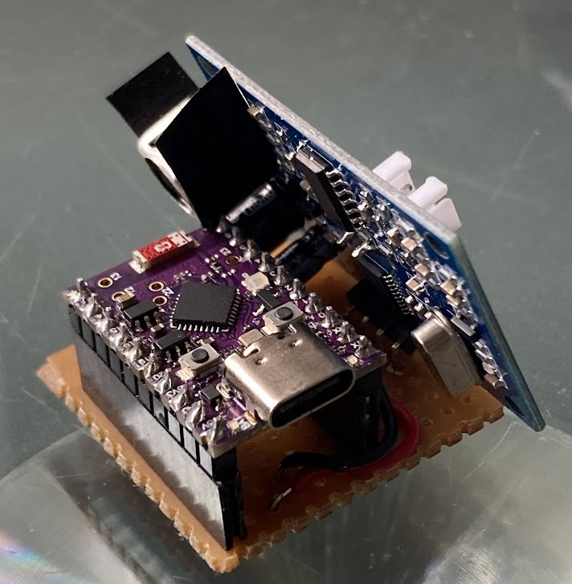
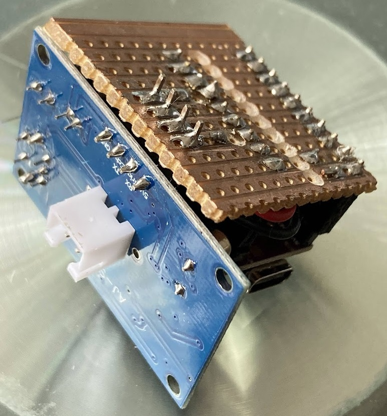
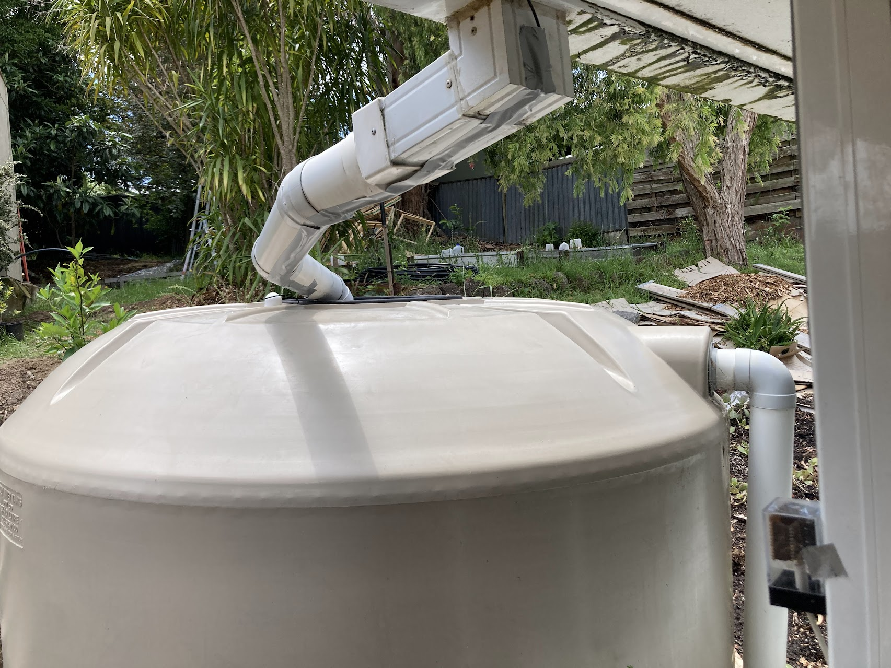

Here are some rough notes on how I built a DIY ultrasonic distance sensor that communicates via Zigbee to Home Assistant running Zigbee2MQTT. I use this to measure the water level in my rainwater tank, which is why you'll see the phrase "tank sensor" here and there.

This is based on this guide, which uses esphome and Wifi: https://www.makeuseof.com/build-water-level-sensor-using-ultrasonic-sensor-and-home-assistant/

ESP32 C6 super mini: https://www.aliexpress.com/item/1005006406538478.html?spm=a2g0o.order_list.order_list_main.17.1f901802PHUS3v
Waterproof Ultrasonic Module JSN-SR04T: https://www.aliexpress.com/item/1005001780453753.html?spm=a2g0o.order_list.order_list_main.11.1f901802PHUS3v

Ultrasonic capture code based on: https://github.com/espressif/esp-idf/tree/v5.3.1/examples/peripherals/mcpwm/mcpwm_capture_hc_sr04
Zigbee router code based on: 
- https://github.com/espressif/esp-zigbee-sdk/tree/main/examples/esp_zigbee_HA_sample/HA_temperature_sensor
- https://github.com/espressif/esp-zigbee-sdk/tree/main/examples/esp_zigbee_HA_sample/HA_color_dimmable_switch

Disorganised collection of thoughts:
I looked through the various types defined by the ZCL and picked the 'illuminance' cluster to transport my distance info because there was no inbuilt limit on its value, a uint16 was large enough, and reporting was enabled for the attribute.

I initially started with multiple analog values. I wanted to make the code more complex to automatically calculate other stuff for me, but due to the roadblocks in the way, I decided to go with something much more simple and targeted and do the calculation in home assistant.

Read some articles on Zigbee endpoints, clusters and attributes. If you want to expose multiple things, I had the most success with multiple endpoints, even if it seems like you'd actually want multiple clusters or attributes.

Here are some problems I ran into:
- Make sure to enable Zigbee in the SDK config page when using the EDF vscode extension (CONFIG_ZB_ENABLED). Have a look through some of the other options in there too.
- Could not change properties on default attributes - would repeatedly crash.
- Could not use some types, e.g. humidity would crash.
- Crashes with "Zigbee stack assertion failed" in esp_zigbee_zcl_command.c assert for anything and everything. Doublecheck that you've used the correct cluster and attribute IDs everywhere.
- "NWK No Active Links Left" when trying to connect, or nothing at all, or it looks like it's connected when it hasn't. Z2m might completely ignore your device if it's a router, with absolutely nothing useful in the logs. Fixed it by clearing the zigbee partition via a factory reset (present in this code when the button is pressed).

I've only briefly covered some of the problems I experienced, mainly to get keywords into this guide so that they show up when someone as desperate as I was googles around for it. Feel free to contact me for help.

tank_sensor.js contains the external converter for this device. See here for how to add it to z2m: https://www.zigbee2mqtt.io/advanced/support-new-devices/01_support_new_devices.html
Useful examples of z2m converters in zigbee-herdsman-converters on github.

I created a template sensor in HA to calculate water level and percentage for me, according to my tank measurements. The formulas I used were:
- Percentage: {{100*(1-(states('sensor.rainwater_tank_distance')|float*10-108.5)/1321.5)}}
- Volume: {{3440*states('sensor.rainwater_percent_full')|float/100}}

Useful references:
- https://zigbeealliance.org/wp-content/uploads/2019/12/07-5123-06-zigbee-cluster-library-specification.pdf
- https://ww1.microchip.com/downloads/en/Appnotes/Atmel-42334-ZigBee-Attribute-Reporting_ApplicationNote_AT08550.pdf
- https://www.reddit.com/r/homeassistant/comments/14kr2th/is_there_any_compatible_water_tank_level_sensor/?rdt=55651

